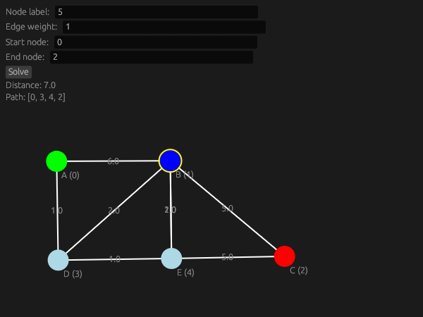

# Graph Editor

A simple graph editor built in Rust using the `egui` library. This tool allows you to create, edit, and visualize graphs with nodes and edges. You can also solve for the shortest path between two nodes using Dijkstra's algorithm.

## Features

- **Create Nodes**: Double-click on the canvas to add nodes.
- **Edit Node Labels**: Click on a node's label to update it.
- **Create Edges**: Select a node, hover over another node, and press `E` to create an edge.
- **Edit Edge Weights**: Click on an edge's weight label to update it.
- **Set Start and End Nodes**: Specify start and end nodes to solve for the shortest path.
- **Solve Shortest Path**: Click the "Solve" button to compute the shortest path using Dijkstra's algorithm.
- **Visualize Path**: The shortest path is highlighted, and the distance and path are displayed.

## Usage Guide

### Running the Program

1. **Install Rust**: If you don't have Rust installed, follow the instructions at [rustup.rs](https://rustup.rs/).
2. **Clone the Repository**:
   ```bash
   git clone https://github.com/nettok/graph-editor.git
   cd graph-editor
   ```
3. **Run the Program**:
   ```bash
   cargo run --release
   ```

### Creating and Editing Nodes

- **Add a Node**: Double-click anywhere on the canvas to add a new node.
- **Edit Node Label**:
  1. Enter a label in the "Node label" text input field.
  2. Click on the label of a node to update it.

### Creating and Editing Edges

- **Add an Edge**:
  1. Click on a node to select it.
  2. Hover over another node and press the `E` key to create an edge.
- **Edit Edge Weight**:
  1. Enter a weight in the "Edge weight" text input field.
  2. Click on the weight label of an edge to update it.

## Screenshots



## Dependencies

- [eframe](https://crates.io/crates/eframe): Framework for building native GUI applications.
- [egui](https://crates.io/crates/egui): Immediate mode GUI library.
